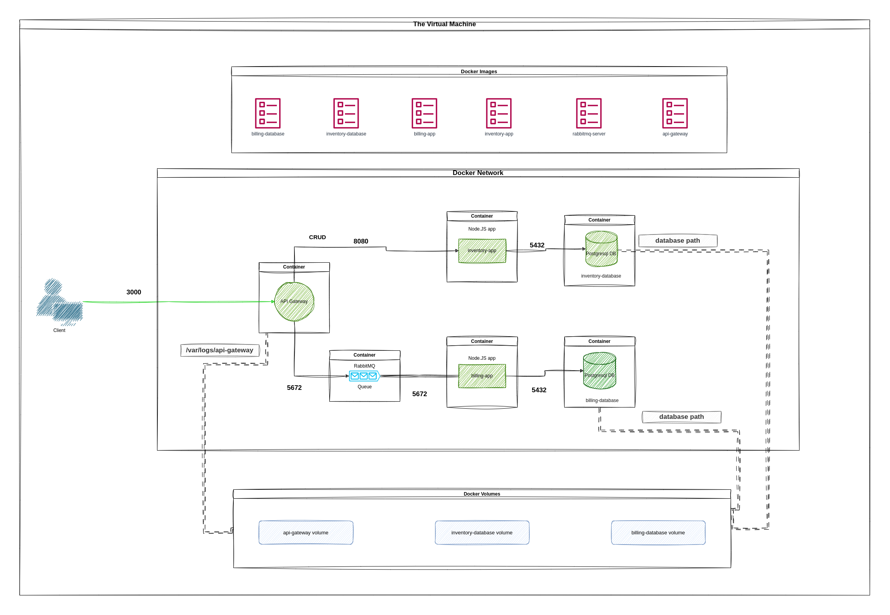

# CRUD Master
## Overview

CRUD Master serves as an educational project aimed at mastering various technologies and libraries. The project revolves around creating a movies API using Many technologies to achieve a simple microservices architecture.

## What I use in this project?

- RESTful CRUD API
- Flask
- SQLAlchemy using ORM
- Docker containerization
- Docker compose
- Docker volumes and networks
- RabbitMQ (message queuing systems)
- PostgeSQL
- JSON Stringifier
- HTTP requests methods

The project subject is provided by 01-edu [Subject](https://github.com/01-edu/public/tree/master/subjects/devops/crud-master-py), but it use multiple VMs using vagrant but here i simply use docker containers for portability, lightweight, scalabilty and containerized deployments.

#### SQLAlchemy 

- It's a Python library that establishes the connection between applications and databases, in this case PostgreSQL. It enables easy execution of INSERT, SELECT, UPDATE, and DELETE operations on database tables using Object-Relational Mapping (ORM). With ORM, database elements can be represented as simple Python classes and manipulated based on API requests.

#### PostgreSQL

- I've build and configure a PostgreSQL container using the Alpine image to efficiently store and manage data related to inventory and billing apps, regardless of the dataset's size. Additionally, I've connected the database path within the container to a Docker volume to ensure persistent data storage.