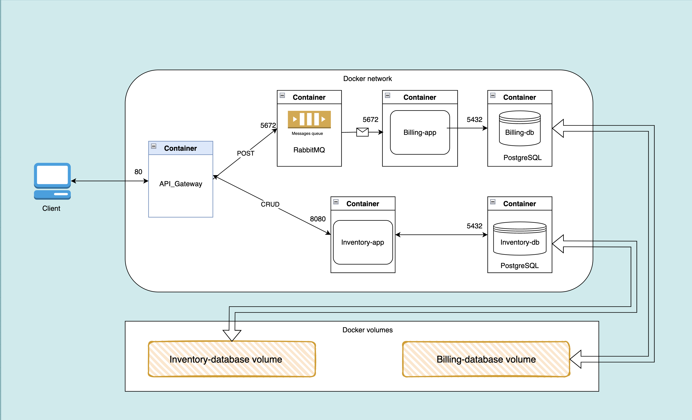

# CRUD Master
## Overview

CRUD Master serves as an educational project aimed at mastering various technologies and libraries. The project revolves around creating a API Gateway to other APIs using Many technologies to achieve a simple microservices architecture.

## What I use in this project?

- Flask
- SQLAlchemy using ORM
- Docker containerization
- Docker compose
- Docker volumes and networks
- RabbitMQ (message queuing systems)
- PIKA (python impementation of AMQP protocol)
- PostgeSQL
- HTTP requests methods

The project subject is provided by 01-edu [Subject](https://github.com/01-edu/public/tree/master/subjects/devops/crud-master-py), but it use multiple VMs using vagrant but here i simply use docker containers for portability, lightweight, scalabilty and containerized deployments, All the containers build in the minimal alpine:3.18 base image.

#### SQLAlchemy 

- It's a Python library that establishes the connection between applications and databases, in this case PostgreSQL. It enables easy execution of INSERT, SELECT, UPDATE, and DELETE operations on database tables using Object-Relational Mapping (ORM). With ORM, database elements can be represented as simple Python classes and manipulated based on API requests.

#### PostgreSQL

- I've build and configure a PostgreSQL container using the Alpine image to efficiently store and manage data related to inventory and billing apps, regardless of the dataset's size. Additionally, I've connected the database path within the container to a Docker volume to ensure persistent data storage.

#### RabbitMQ

- The most popular message broker, RabbitMQ, is extensively used in microservices architecture for facilitating communication between services. RabbitMQ provides the capability to manage the flow of messages and enables the selection of the appropriate service for sending messages based on their content or the service's ability to process them, and all that done using AMQP (The Advanced Message Queuing Protocol) protocol, a protocol  designed to efficiently support a wide variety of messaging applications and communication patterns.

#### PIKA

- Python implementation of the AMQP protocol, a library that provides a way to interact with RabbitMQ and allows sending and receiving messages under the AMQP protocol to and from RabbitMQ. It provides an interface to create producers and consumers for RabbitMQ.

#### Docker and Docker-compose

- In the project, Docker helps a lot by containerizing each app in its isolated container and establishing connections between them using Docker's network (typically a bridge network). Docker Compose is used to orchestrate the containers, managing their volumes, networks, and environments.

#### Flask

- Flask, renowned as a micro web framework, plays a pivotal role in serving our applications efficiently. Its lightweight nature and simplicity make it an ideal choice for developing web applications with ease. With Flask, not only can we quickly set up routes to handle HTTP requests, but we can also organize our application's logic using Flask blueprints.